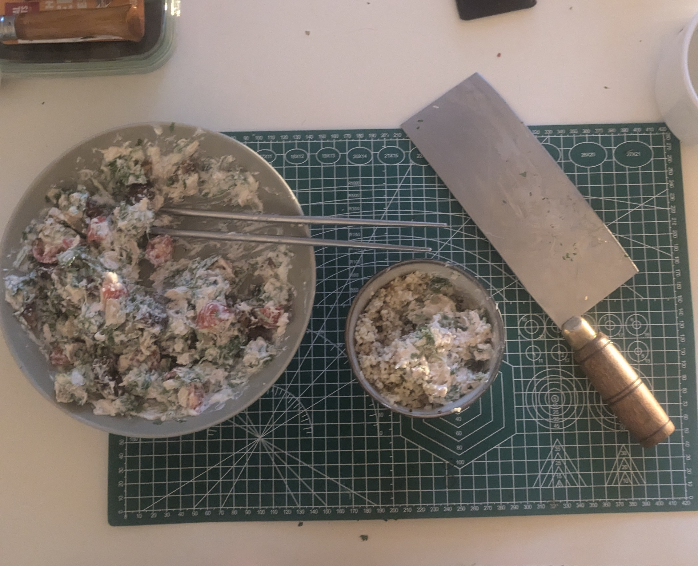

+++
title =  "Prepare Chicken Salad"
date = "2024-06-16 21:35:34.376 -0500" 
description = "Preparing chicken salad with some left-over supplies"
author = "Justin Napolitano"
tags = ['cooking']
images = ["./images/dinner.jpg"]
categories = ['food']
+++

## Why

I am hungry. I have a bunch of ingredients. I have a left over rotisserie chicken. I do not want to waste.  

## Audit your supplies

In my case I have at my disposal

1. About half a rotisserie chicken.
2. Greek yogurt.
3. Coriander.
4. Grape tomatotes.
5. Honey.
6. Dates.
    

## Prepare your food

### Cut up the chicken breast

Just remove chicken breast. Then cut it up into small chunks. 

### Cut up the herbs

I am using left-over coriander leaves to add some vitamins and flavor to my dinner. I just chop and chop and chop until I find the consistency that I like. 

### Mix the chicken and herbs

I wasn't sure what all I would add to this yet, so I mixed in the herbs and chicken into bowl.  I tried it and felt like it was missing something. 

### Mix in some greek yogurt

So next I added some greek yogrut. I like the fage 5%. Use whichver you like, but this is right one.  

### Cut up some tomatoes

The consistency of the mix with just the yogurt, chicken, and herbs wasn't bad actually... but it wasn't really what I wasn't looking for.  Maybe if I had wanted something savory i could have used the base i had as is... anyways... Next i cut up some grape tomatoes. i cut maybe 8 or 9 into quarters. I mixed that in and things tasted better. 

### Cut up some dates

I decided that i wanted something a bit more sweet to go with my millet rice.  I added about 6 dates to the mix cut into 6 pieces each. This was a good choice. 

### Add some honey

The mix was really good, but i wanted something sweet. Not quite desert sweet, but i wanted something to cut through the tanginess of the yogurt and the planty-ness of the 1 day old herbs. I added honey. Just a bit. Another good choice

### Serve with millet-rice

One of my favorite ways to eat grains is a mixture of millet, quinoa, and rice.  I'll detail the mixture in another post, but the basic mixture is 

1. 2 parts rice
2. 1 part millet
3. 1 part quinoa

I am no expert but this seems like a pretty healthy mixture of grains for nutrition. 

## Enjoy with your cat

So if you're making and reading this... i would imagine that you are a cat person like me. Idk how we get to this point in our lives.. but thats where we are.  Here is my boy watching me eat

